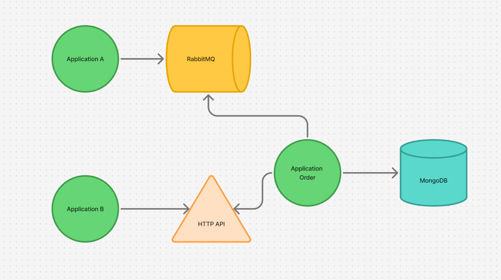

# Projeto .NET Core com ASP.NET 8.0 e Docker

## 📄 Descrição do Projeto

Este projeto é uma aplicação desenvolvida utilizando ASP.NET Core 8.0 e C# 12.0. 
Ele apresenta uma aplicação moderna que utiliza o padrão web API, além de integração com **RabbitMQ** para serviços de mensageria e **MongoDB** como banco de dados NoSQL. 
A aplicação simula um ambiente de gestão de pedidos (Order) em alta demanda. Ela é configurada para ser executada localmente ou em ambientes isolados com Docker e Docker Compose, proporcionando facilidade de uso e portabilidade em ambientes de desenvolvimento.

---

## ✅ Tecnologias Utilizadas

O projeto faz uso das seguintes tecnologias:

- **.NET 8.0**: Framework utilizado para desenvolvimento back-end.
- **ASP.NET Core**: Usado para desenvolvimento da API moderna e robusta.
- **C# 12.0**: Linguagem de programação utilizada no desenvolvimento.
- **RabbitMQ**: Sistema de mensageria para troca de mensagens entre serviços.
- **MongoDB**: Banco de dados NoSQL utilizado para armazenar documentos.
- **Docker**: Para criação de containers de cada serviço (aplicação, RabbitMQ e MongoDB).
- **Docker Compose**: Para facilitar a orquestração e execução de múltiplos containers.

---

## 🚀 Como Executar o Projeto

Existem duas formas principais de executar o projeto: diretamente com o .NET CLI ou utilizando Docker e Docker Compose. Abaixo, todos os detalhes de execução.

### Pré-requisitos

Para executar o projeto, você precisa ter os itens a seguir instalados:

- **.NET SDK 8.0** (se você for executar o projeto localmente).
- **Docker** e **Docker Compose** (se você preferir usar o ambiente containerizado).

---

## 🔧 Execução Local com o .NET CLI

1. **Clone o repositório**:

   ```bash
   git clone git@github.com:DevGuilhermeSv/Order-Processor.git
   cd Order-Processor
   ```

2. **Configure a conexão com MongoDB e RabbitMQ**:

   Certifique-se de que os serviços do **MongoDB** e do **RabbitMQ** estejam rodando na sua máquina e que as strings de conexão estejam configuradas corretamente no arquivo `appsettings.json`:

   ```json
   {
     "MongoDB": {
       "ConnectionString": "mongodb://localhost:27017",
       "DatabaseName": "nome_do_banco"
     },
     "RabbitMQ": {
       "Host": "localhost",
       "Port": 5672,
       "UserName": "admin",
       "Password": "admin"
     }
   }
   ```

3. **Restaurar as dependências do projeto**:

   ```bash
   dotnet restore
   ```

4. **Compilar e rodar a aplicação**:

   ```bash
    dotnet run --project .\Order\Order.csproj
   ```

   A API estará disponível em `http://localhost:5000` (ou outro endereço configurado).

---

## 🐳 Execução com Docker e Docker Compose

Esta é a forma mais conveniente de executar o projeto, pois não exige configurações manuais em sua máquina local.

1. **Certifique-se de ter o Docker instalado** em sua máquina e ativo.

2. **Suba os containers usando o Docker Compose**:

   O arquivo `docker-compose.yml` já está configurado para executar a aplicação, RabbitMQ e MongoDB. Rode o seguinte comando:

   ```bash
   docker-compose up --build
   ```

3. **Aguarde os serviços iniciarem**:

   - O **RabbitMQ** estará disponível em: `http://localhost:15672`
   - O **MongoDB** estará disponível na porta `27017` (padrão).
   - A aplicação estará rodando em: `http://localhost:5000`.

4. **Desligar os containers**:

   Para encerrar todos os containers criados, execute:

   ```bash
   docker-compose down
   ```
---

## 🗂 Teste de Carga

É possível executar um teste de carga de pedidos para a aplicação. O **ProducerOrder** é uma aplicação dedicada para
simular uma alta quantidade de pedidos enviados para a API principal. Isso é útil para avaliar o desempenho da aplicação
e sua capacidade de processamento.

### 🚀 Como Executar o ProducerOrder

1. **Clone o repositório** (certifique-se de que o repositório principal já está clonado, pois o `ProducerOrder` está
   incluído nele).

   ```bash
   git clone git@github.com:DevGuilhermeSv/Order-Processor.git
   cd Order-Processor
   ```

2. **Configure a aplicação**:

   Certifique-se de que as configurações de conexão com o RabbitMQ no `appsettings.json` estejam corretas e apontando
   para os serviços em execução:

   ```json
   {
   "RabbitMq": {
      "Host": "localhost",
      "Username": "guest",
      "Password": "guest",
      "Queue": "order-queue"
   },
   "Carga": {
      "TotalPedidos": 1000,
      "IntervaloMs": 4
   }
   }
   ```

3. **Restaurar as dependências do projeto**:

   ```bash
   dotnet restore
   ```

4. **Executar o ProducerOrder**:

   Navegue até o diretório da aplicação de teste de carga e inicie-a:

   ```bash
   dotnet run --project .\ProducerOrder\ProducerOrder.csproj
   ```

5. **Monitorar os testes**:

   A aplicação começará a enviar pedidos em alta carga para a fila do RabbitMQ configurada. Você pode monitorar os
   pedidos no painel de controle do RabbitMQ (`http://localhost:15672`) ou nos logs da aplicação consumidora.

6. **Finalizar o teste**:

   Para parar o `ProducerOrder`, utilize `Ctrl+C` no terminal onde ele está sendo executado.

---

## 🗂 Estrutura do Projeto

A aplicação segue uma estrutura limpa e modular:
- Controllers/ # Controllers da API
- Services/ # Regras de negócio e serviços
- Repositories/ # Comunicação com o MongoDB
- Models/ # Modelos de dados
- MessageQueue/ # Configuração do RabbitMQ
- appsettings.json # Configurações da aplicação
- Dockerfile # Configuração do container da aplicação
- docker-compose.yml # Configuração geral dos containers


---

## 🐇 Configuração do RabbitMQ

Para acessar o painel de controle do RabbitMQ durante a execução com Docker:

- URL: `http://localhost:15672`
- Usuário: `admin`
- Senha: `admin`

---

## 📦 Configuração do MongoDB

O MongoDB é configurado para rodar no container com as seguintes credenciais padrão:

- Host: `localhost`
- Porta: `27017`

Você pode acessar o MongoDB localmente ou utilizando uma ferramenta como **MongoDB Compass**.

---

## 🛠 Personalização e Configuração

Você pode personalizar variáveis como conexões de banco de dados e credenciais de mensageria alterando o arquivo `appsettings.json` ou o `docker-compose.override.yml`.

### Diagrama de Exemplo
